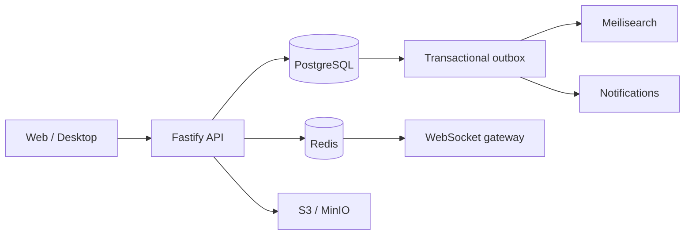

## Choose a path

### Explore the project

Read the [introduction](/guide/introduction) for a concise description of the
product and its current state. Continue to [core concepts](/guide/core-concepts)
to understand the vocabulary used throughout the repository.

### Build and integrate

Use the [quickstart](/guide/quickstart) to run the API and local services. The
practical guides cover [authentication](/guide/guides/authentication),
[community setup](/guide/guides/community-setup),
[permissions](/guide/guides/permissions),
[realtime](/guide/guides/realtime), and [files](/guide/guides/files).

## Architecture at a glance

PostgreSQL owns durable state. Redis carries presence and realtime streams.
Outbox records connect committed changes to gateway delivery, search, and
notifications. Read the [system overview](/guide/system-overview) for the
boundaries and tradeoffs, or open the [API reference](/api/reference) for exact
request and response schemas.
