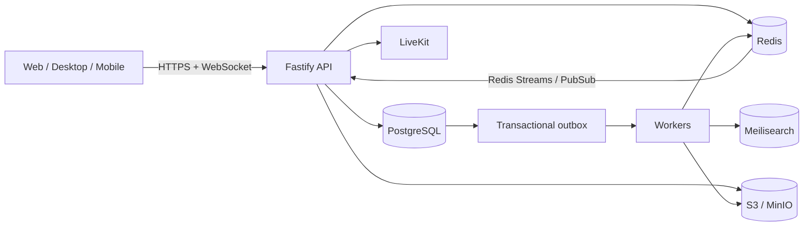

# Strafe — Data, Server, and Realtime Architecture

> Status: implemented in `apps/api`. The 56-table schema covers secure sessions
> and account challenges, quarantined multipart uploads, moderation and appeals,
> notifications/digests, and the transactional outbox. Redis provides
> multi-instance realtime and automod, S3/MinIO stores files, ClamAV scans them,
> and Meilisearch provides indexes.

## 1. Goals and principles

Strafe supports communities similar to a full-featured messaging platform:
users, servers, channels, roles, messages, relationships, presence, voice,
moderation, and notifications. Responsibilities are deliberately separated:

- **PostgreSQL 17.6** is the source of truth for durable data.
- **Redis** stores presence, typing, short-lived locks, rate limits, permission
  cache, and the realtime event stream.
- **S3/MinIO** stores objects; PostgreSQL stores metadata and object keys only.
- **Meilisearch** indexes messages, users, and servers but never decides access.
- **Workers** handle indexing, derivatives, file scanning, e-mail, and cleanup.
- **LiveKit** handles voice/video; Strafe issues short-lived tokens and stores
  only the summaries needed by the product.

Public identifiers are UUIDv7 values generated by the API. Timestamps are UTC
`timestamptz`. SQL names use `snake_case`; product states use `text` plus
`CHECK` constraints instead of PostgreSQL enums to keep migrations flexible.

## 2. System overview



An operation is complete only after its PostgreSQL transaction commits. Redis,
search, and WebSockets are updated asynchronously from `outbox_events`, so a
worker outage does not lose the event.

## 3. Domains and tables

### 3.1 Identity, authentication, and profiles

| Table                | Purpose                                  | Important fields                                                                                                       |
| -------------------- | ---------------------------------------- | ---------------------------------------------------------------------------------------------------------------------- |
| `users`              | Account lifecycle                        | `id`, `handle`, `normalized_handle`, `email`, `email_verified_at`, `status`, `created_at`, `disabled_at`, `deleted_at` |
| `user_profiles`      | Public profile                           | `user_id`, `display_name`, `bio`, `avatar_file_id`, `banner_file_id`, `pronouns`                                       |
| `user_settings`      | Privacy and app preferences              | `user_id`, `locale`, `theme`, `timezone`, `discoverability`, `allow_dms_from`                                          |
| `auth_identities`    | Password, OAuth, and passkey credentials | `user_id`, `provider`, `provider_subject`, `password_hash`, `credential_data`                                          |
| `user_sessions`      | Revocable sessions                       | `id`, `user_id`, `device_id`, `refresh_token_hash`, `expires_at`, `revoked_at`                                         |
| `user_devices`       | Known devices and push state             | `id`, `user_id`, `name`, `platform`, `last_seen_at`, `trusted_at`                                                      |
| `user_relationships` | Friend requests and relationships        | `requester_id`, `addressee_id`, `status`, `created_at`, `accepted_at`                                                  |
| `user_blocks`        | User blocks                              | `blocker_id`, `blocked_id`, `reason`, `created_at`                                                                     |

`normalized_handle` is unique and computed by one versioned normalization rule.
Passwords use Argon2id. Raw refresh tokens, recovery codes, API keys, and invite
codes are never stored; only hashes are persisted.

Account deletion is asynchronous: disable the account, revoke sessions,
pseudonymize personal data, and enqueue file deletion. Messages may remain under
an “Deleted User” author according to the retention policy.

### 3.2 Servers and membership

| Table                    | Purpose                        | Important fields                                                                                         |
| ------------------------ | ------------------------------ | -------------------------------------------------------------------------------------------------------- |
| `servers`                | Community root                 | `id`, `owner_id`, `name`, `slug`, `icon_file_id`, `description`, `visibility`, `member_count`, `version` |
| `server_members`         | User membership                | `id`, `server_id`, `user_id`, `state`, `joined_at`, `left_at`, `timeout_until`                           |
| `server_member_profiles` | Per-server profile             | `member_id`, `nickname`, `avatar_file_id`, `bio`                                                         |
| `server_roles`           | Role hierarchy                 | `id`, `server_id`, `name`, `color`, `position_key`, `permissions`, `is_default`                          |
| `server_member_roles`    | Role assignments               | `member_id`, `role_id`, `assigned_by`, `assigned_at`                                                     |
| `server_invites`         | Invites and usage limits       | `id`, `server_id`, `channel_id`, `code_hash`, `max_uses`, `uses`, `expires_at`, `revoked_at`             |
| `server_bans`            | Bans independent of membership | `server_id`, `user_id`, `moderator_id`, `reason`, `expires_at`                                           |
| `server_emojis`          | Server emojis                  | `id`, `server_id`, `name`, `file_id`, `creator_id`                                                       |

`(server_id, user_id)` is unique. Rejoining atomically reactivates membership and
increments `membership_version` instead of creating duplicates. Counters such as
`member_count` are caches; a periodic job reconciles them with actual rows.

The owner cannot leave without transferring ownership. Server deletion has a
grace period: `deletion_scheduled_at` blocks new invites and a worker removes
resources in batches after the deadline.

### 3.3 Roles and permissions

`server_roles.permissions` is a versioned 63-bit `bigint` mask. The API encodes it
as a decimal string so JavaScript cannot lose precision. Bits include
`view_channel`, `send_messages`, `manage_messages`, `connect_voice`,
`mute_members`, `manage_channels`, `manage_roles`, and `administrator`.

`channel_permission_overwrites` contains `channel_id`, `subject_type` (`role` or
`member`), `subject_id`, `allow_bits`, and `deny_bits`, with uniqueness on
`(channel_id, subject_type, subject_id)`.

Permission resolution is deterministic:

1. the server owner receives full access;
2. calculate the default `@everyone` role;
3. combine the member’s roles;
4. apply channel overwrites: `@everyone`, roles, then the member;
5. apply safety blocks, bans, and timeouts regardless of role bits.

Role changes validate hierarchy on both sides. `position_key` uses sparse ordering
keys so moving one role does not rewrite hundreds of rows. Permission results can
be cached in Redis using `server.version` and `member.permissions_version`.

### 3.4 Channels, categories, threads, and DMs

One `channels` table simplifies navigation and messaging. Supported types include
`category`, `text`, `announcement`, `forum`, `voice`, `stage`,
`thread_public`, `thread_private`, `dm`, and `group_dm`.

Core fields are `id`, `server_id`, `parent_id`, `owner_id`, `type`, `name`,
`topic`, `position_key`, `flags`, `slowmode_seconds`, `last_message_id`,
`archived_at`, `locked_at`, and `deleted_at`. Constraints require DMs to omit
`server_id` and server channels to include it; parents must belong to the same
server.

Additional tables:

- `channel_members` — DM, group DM, and private-thread recipients;
- `direct_conversations` — canonical `(lower_user_id, higher_user_id)` DM pair;
- `channel_voice_settings` — bitrate, capacity, region, and waiting-room mode;
- `forum_tags` and `forum_post_tags` — forum labels;
- `channel_webhooks` — webhooks with hashed secrets.

Private server channels do not use `channel_members`; visibility comes from roles
and overwrites. A thread is a full channel with `parent_id`, archive state, and
its own participant list.

### 3.5 Messages and activity

| Table                    | Purpose                                                                 |
| ------------------------ | ----------------------------------------------------------------------- |
| `messages`               | Content, author, channel, replies, flags, nonce, edit/delete timestamps |
| `message_edits`          | Optional previous versions for moderation                               |
| `message_attachments`    | Message-to-file links                                                   |
| `message_embeds`         | Safe link metadata snapshots                                            |
| `message_mentions`       | Normalized user, role, and channel mentions                             |
| `message_reactions`      | One user reaction per emoji                                             |
| `message_pins`           | Pin author and timestamp                                                |
| `channel_read_states`    | Last read message/time and mention count                                |
| `user_message_bookmarks` | Private saved messages                                                  |

`messages` contains `channel_id`, `author_id`, `client_nonce`,
`reply_to_message_id`, `content`, `type`, `flags`, `created_at`, `edited_at`, and
`deleted_at`. Unique `(author_id, client_nonce)` makes sends idempotent after a
connection loss. Ordering is `(created_at, id)`; clients cannot provide
`created_at`.

Soft-deleted content becomes empty or a controlled tombstone while the row stays
for pagination and ordering. Edits retain previous content only when policy
requires it. Reactions use `(message_id, emoji_key, user_id)`.

History uses a cursor encoded from `(created_at, id)`; `OFFSET` is avoided because
its cost grows with history depth.

### 3.6 Files and media

`files` stores `id`, `owner_id`, `server_id`, `purpose`, `object_key`,
`original_name`, `mime_type`, `size_bytes`, `sha256`, dimensions, duration,
`status`, `scan_status`, and `created_at`. `file_variants` describes thumbnails,
waveforms, and optimized formats.

Upload flow:

1. create `file_uploads`, initiate S3 multipart, and sign each part;
2. upload directly to storage and submit ETags;
3. verify object size and move the file to `quarantined`;
4. inspect MIME and ClamAV, remove EXIF, and generate derivatives;
5. allow message attachment only after status `ready`;
6. cancel expired multipart uploads and delete orphaned objects.

Permanent public URLs are never stored. A download URL is created only after an
authorization check.

### 3.7 Moderation, safety, and audit

`moderation_cases`, `moderation_actions`, `moderation_appeals`, `user_reports`,
`automod_rules`, `automod_events`, and `audit_log` form the case queue and full
history. Actions include warning, content removal, timeout, kick, and ban.
Separate permissions control reports, cases, and automod rules.

`audit_log` is append-only and contains `server_id`, `actor_id`, `action`,
`target_type`, `target_id`, `reason`, `metadata`, and `created_at`. JSON metadata
is a supporting snapshot, not a replacement for relations. Sensitive IP and user
agent data have restricted retention and access.

Automod checks words, links, flood, and spam before message persistence. Redis
shares spam counters and raid detection across API instances. Timeouts and raids
create replayable cases, actions, audits, and outbox events.

### 3.8 Notifications, integrations, and events

- `notifications` — durable inbox with `read_at` and `seen_at`;
- `notification_preferences` — global, per-server, and per-channel settings;
- `push_subscriptions` — Web Push keys, rotation, and last error;
- `notification_digests` — idempotent immediate, hourly, and daily delivery;
- `applications`, `bots`, `integration_installations` — scoped integrations;
- `outbox_events` — reliable bridge between transactions and workers;
- `webhook_deliveries` — attempts, responses, retries, and dead-letter state.

`outbox_events` stores `id`, `topic`, `aggregate_type`, `aggregate_id`,
`aggregate_version`, `payload`, `available_at`, `attempts`, `processed_at`, and
`last_error`. Workers claim rows with `FOR UPDATE SKIP LOCKED`, use idempotent
consumers and exponential retry, and preserve dead-letter records for inspection.

## 4. Presence, typing, and realtime

Presence must not write PostgreSQL on every heartbeat. Durable state is limited to
manual status (`online`, `idle`, `dnd`, `invisible`), custom status and expiry,
privacy settings, and an approximate delayed `last_seen_at`.

### Redis state

| Key                               | Contents                                   | Retention                  |
| --------------------------------- | ------------------------------------------ | -------------------------- |
| `presence:session:{sessionId}`    | user, device, gateway, activity, heartbeat | 75-second TTL              |
| `presence:user:{userId}:sessions` | session heartbeat sorted set               | cleaned during aggregation |
| `presence:user:{userId}:state`    | aggregate state and version                | 90-second TTL              |
| `typing:{channelId}:{userId}`     | typing marker                              | 10-second TTL              |
| `voice:{channelId}:{userId}`      | mute, deaf, camera, stream, LiveKit SID    | renewed by gateway         |
| `stream:user:{userId}`            | resumable events                           | approximately 24 hours     |

Clients heartbeat every 25 seconds. Missing renewal for 75 seconds means offline;
a short grace period prevents flicker during network changes. Aggregation across
devices follows this order:

1. `invisible` appears offline to other users;
2. manual `dnd` takes precedence;
3. any active session makes the user online;
4. idle-only sessions make the user idle;
5. no live sessions means offline.

Only aggregate state changes fan out `presence.changed`. Per-server online sets
update on online/offline transitions, not every heartbeat. Blocks, invisible mode,
and privacy settings are applied before fanout.

### WebSocket events

Every event has `event_id`, `type`, `occurred_at`, `stream_id`, `aggregate_id`,
`version`, and versioned `data`. The client sends `lastStreamId` in `identify`.
The API replays a short stream gap after reconnect; an expired or oversized gap
returns `resync_required`, after which the client fetches a REST snapshot. The
gateway deduplicates `eventId` and buffers events while resuming.

Gateway rooms are `server:{id}`, `channel:{id}`, and `user:{id}`. Membership is
checked before joining a room, and permission changes remove inaccessible rooms.
Typing is transient, rate-limited, and never stored in PostgreSQL or outbox.
Frame size, command rate, subscription count, output buffer, and heartbeat timeout
are enforced.

## 5. Voice and stage

PostgreSQL stores channel configuration while Redis/LiveKit stores live state. The
API checks `view_channel` and `connect_voice`, atomically reserves a user, issues
a 30–60 second LiveKit token, publishes `voice.state_changed`, and clears state on
disconnect.

Optional `voice_sessions` and `voice_session_participants` retain only join/leave
times, region, and end reason for moderation and metrics. Stage channels add
speaker/listener roles, `requested_to_speak_at`, and a Redis queue.

## 6. Query-oriented indexes

Indexes follow real endpoint queries. PostgreSQL does not automatically index
foreign keys, so every frequently joined child table needs an index.

| Query                  | Index                                                                    |
| ---------------------- | ------------------------------------------------------------------------ |
| Channel history        | `messages (channel_id, created_at DESC, id DESC)`                        |
| Active server channels | `channels (server_id, parent_id, position_key) WHERE deleted_at IS NULL` |
| User servers           | `server_members (user_id, joined_at DESC) WHERE state = 'active'`        |
| Member roles           | `server_member_roles (member_id, role_id)`                               |
| Active sessions        | `user_sessions (user_id, expires_at) WHERE revoked_at IS NULL`           |
| Pending outbox         | `outbox_events (available_at, id) WHERE processed_at IS NULL`            |
| Server audit           | `audit_log (server_id, created_at DESC, id DESC)`                        |
| Unread notifications   | `notifications (user_id, created_at DESC) WHERE read_at IS NULL`         |

Unique indexes cover normalized handles, membership, role assignments, reactions,
and canonical DMs. GIN indexes for JSONB are added only for measured operators.
Meilisearch handles text search; the PostgreSQL fallback may use a generated
`tsvector` with a GIN index. New hot paths require `EXPLAIN (ANALYZE, BUFFERS)` on
realistic data.

## 7. Transactions and race resistance

### Sending a message

One short transaction checks membership/permission, performs an idempotent insert,
binds ready files, conditionally updates `channels.last_message_id`, and appends
`message.created` to outbox. Uploads, webhooks, and external calls stay outside
the transaction.

### Joining through an invite

The API locks the invite row with `FOR UPDATE`, checks expiry, usage, bans, and
capacity, upserts membership, assigns the default role, increments usage, and
adds outbox. Locks are acquired in a stable order to reduce deadlocks.

### Roles and ordering

Role changes lock member rows in ID order and recheck hierarchy in the transaction.
Channel/role reordering uses a short advisory lock on the server ID. Administrative
operations accept `expected_version`; conflicts return `409` instead of silently
overwriting another change.

## 8. Scaling and partitioning

Tables start unpartitioned. Consider partitioning only after measurements, usually
near 100 million rows or when vacuum/retention becomes a problem:

- `audit_log`, `outbox_events`, and `webhook_deliveries`: monthly time partitions;
- `messages`: RANGE by time for retention or HASH by `channel_id` for locality;
- archive or detach old partitions instead of running a massive `DELETE`.

The API uses connection pools; production uses PgBouncer in transaction mode.
HTTP, realtime, and workers have separate pools and limits. Read replicas may serve
discovery and analytics, but read-after-write stays on primary.

Redis may be clustered, with presence keys sharded by `user_id`. Gateways are
stateless: after restart they rebuild rooms from live connections and replay gaps
from Redis Streams.

## 9. Data security

- separate DB roles: `migrator`, `api_runtime`, `worker`, and read-only observability;
- private schemas for technical functions and no unnecessary `PUBLIC` privileges;
- parameterized Drizzle queries and payload limits on every endpoint;
- authorization in the API, with optional RLS as a second tenant boundary;
- RLS requires matching `server_id`/`user_id` indexes and negative tests;
- secrets are hashed or encrypted with keys outside the database;
- export and deletion are separate audited jobs;
- encrypted daily backups with scheduled restore tests;
- PITR, replication alerts, and documented RPO/RTO are production requirements.

## 10. Retention and cleanup

| Data                          | Suggested retention               |
| ----------------------------- | --------------------------------- |
| Presence and typing           | seconds/minutes in Redis          |
| Redis resume streams          | 24 hours                          |
| Revoked sessions              | 30–90 days                        |
| Failed outbox/webhook records | 30 days after resolution          |
| Raw security data             | 30–90 days, policy dependent      |
| Server audit log              | at least one year or owner policy |
| Orphaned uploads              | 24 hours                          |
| Soft-deleted messages/files   | grace period, then content purge  |

Retention jobs use small batches, time limits, and telemetry. Never run a
multi-million-row delete in one transaction.

## 11. Code and migration structure

```text
apps/api/src/db/
  schema/
    identity.ts
    servers.ts
    permissions.ts
    channels.ts
    messages.ts
    files.ts
    moderation.ts
    notifications.ts
    outbox.ts
    index.ts
  queries/
  transactions/
  repositories/
```

Public contracts belong in `packages/shared`; Drizzle entities stay in `apps/api`.
The API maps rows to DTOs instead of returning database records directly, keeping
private columns from leaking when the schema grows.

Migrations follow **expand → migrate → contract**:

1. add a compatible field or table;
2. deploy code that supports old and new formats;
3. backfill in small batches;
4. switch reads;
5. remove the old field in a later release.

CI applies migrations to a fresh database and tests upgrades. Large production
indexes use `CONCURRENTLY`; risky constraints start as `NOT VALID` and are later
validated.

## 12. Observability and SLOs

Measure at least:

- p50/p95/p99 message send and delivery latency;
- WebSocket connections, reconnects, and `RESYNC_REQUIRED` responses;
- outbox, queue, and search-index lag;
- permission-cache hit/miss ratio;
- DB connections, slow queries, deadlocks, and replication lag;
- table/index size, dead tuples, and autovacuum rate;
- upload, scan, and webhook success rates.

Initial targets: read API p95 < 200 ms, message send p95 < 300 ms, one-region
realtime fanout p95 < 500 ms, and 99.9% availability. `pg_stat_statements`,
OpenTelemetry, Prometheus, and Sentry share `request_id`/`trace_id`.

## 13. Delivery plan

### Stage A — identity and servers

Users, profiles, sessions, devices, servers, membership, roles, and invites are
implemented. Done means a user can safely register, create a server, invite a
member, and transfer ownership.

### Stage B — channels and messages

Channels, overwrites, messages, reactions, replies, read state, and cursor
pagination are implemented with access-denial, idempotency, and concurrency tests.

### Stage C — outbox and realtime

Redis, event delivery, WebSocket gateway, versioned events, reconnect, and resync
are implemented. Restarting a worker or gateway must not lose a message.

### Stage D — presence and voice

Multi-session presence, typing, privacy, LiveKit, and stage channels are
implemented. Network loss must clean state without leaving ghost users online or
in voice.

### Stage E — files, moderation, and notifications

S3/MinIO, scanning, variants, reports, automod, audit, push, and e-mail are
implemented in the API. Production still requires configured services and
operational monitoring.

### Stage F — search and hardening

Meilisearch and permission-aware search are implemented. Remaining work is load
testing, PgBouncer, backups/PITR, retention, chaos testing, and SLO dashboards.
Partitioning waits for measured evidence.

## 14. Decisions we do not defer

- PostgreSQL is the only source of truth; Redis and Meilisearch are rebuildable.
- Presence, typing, and live voice state do not enter PostgreSQL.
- Every durable side effect goes through the transactional outbox.
- Every endpoint checks membership and permissions on the server.
- Large lists use cursor pagination.
- Sends, uploads, and webhooks are idempotent.
- Constraints and query-driven indexes are designed with the schema.
- DM E2EE, active-active multi-region, and public federation are separate projects.

## 15. Open product decisions

Before future migrations, approve server and file limits, message retention,
edit-history policy, discovery scope, age/consent requirements, legal constraints,
data region, DM E2EE, and whether owners can require shorter retention. Record the
answers as ADRs because they affect constraints, storage, and moderation.
