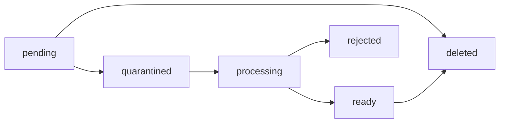

# Files and Attachments

Files are uploaded directly to S3-compatible storage with signed multipart
URLs. The API records ownership and lifecycle state, but it does not proxy the
file body.



## 1. Initiate an upload

```bash
curl --request POST http://localhost:3000/api/files/uploads \
  --header "Authorization: Bearer $STRAFE_ACCESS_TOKEN" \
  --header "Content-Type: application/json" \
  --data '{
    "originalName": "diagram.png",
    "mimeType": "image/png",
    "purpose": "attachment",
    "sizeBytes": 248392,
    "serverId": "123e4567-e89b-12d3-a456-426614174000"
  }'
```

The response contains `uploadId`, `fileId`, part size, expiry, and initial signed
part URLs. MIME type, purpose, configured size limit, and user quota are checked
before storage is allocated.

## 2. Upload every part

Send each byte range to its signed URL with `PUT`. Save the `ETag` response
header. Request another URL through
`POST /api/files/uploads/{uploadId}/parts` when a part URL expires.

## 3. Complete the upload

```json
{
  "parts": [{ "partNumber": 1, "etag": "returned-storage-etag" }]
}
```

POST this body to `/api/files/uploads/{uploadId}/complete`. Parts must be unique,
ordered, and complete. The object moves to `quarantined`; it is not attachable
yet.

## 4. Wait for processing

Poll `GET /api/files/{fileId}` or listen for `file.ready` and `file.rejected`
events. Processing verifies detected MIME type, scans with ClamAV, removes image
metadata through re-encoding, and creates supported image, video, or audio
variants.

When scanning is required but unavailable, the file remains quarantined rather
than becoming public. This is intentional fail-closed behavior.

## 5. Attach or download

Only a `ready` file can be attached to a message. The message service verifies
ownership and conversation scope. Downloads use
`GET /api/files/{fileId}/download`, which returns a short-lived authorized URL.

Abort an unfinished upload with `DELETE /api/files/uploads/{uploadId}`. A cleanup
worker also expires abandoned multipart uploads.

## End-to-end encrypted attachments

Message attachments can use `encryptionMode: "e2ee-v1"`. The client must first
check the asserted MIME type and plaintext size against its local allowlist,
show an explicit warning for executable or script-like names, and then create a
fresh random 256-bit file key for every file. It encrypts independent chunks
with AES-256-GCM. The binary format contains a random 64-bit nonce prefix and a
monotonic 32-bit chunk counter, so a nonce is never reused under a file key and
a recipient can authenticate and release one downloaded chunk at a time.

Only the resulting octet-stream, its ciphertext size, `e2ee-v1`, and the chunk
size are supplied when initiating the upload. The API deliberately stores an
empty original name, the generic `application/octet-stream` type, and an opaque
object key. The file key, original name and MIME type, plaintext SHA-256, size,
and optional preview metadata belong in the attachment's encrypted message
envelope (`attachmentEnvelopes[fileId]`), never in file-upload fields, logs,
storage metadata, push text, or other unprotected notifications.

An E2EE upload becomes `ready` after the object store confirms its declared
ciphertext length. It never enters `file-processing.service.ts`: the server
cannot decrypt it, validate its claimed content, scan it for malware, remove
metadata, generate thumbnails/waveforms, or transcode it. Consequently clients
must treat decrypted downloads as untrusted, repeat type/size checks after
authenticated decryption, verify the envelope's plaintext hash, warn before
opening dangerous formats, and render previews from the encrypted envelope.
This privacy-versus-server-moderation tradeoff is fundamental; deployments that
require server malware scanning must use the existing unencrypted upload mode.
