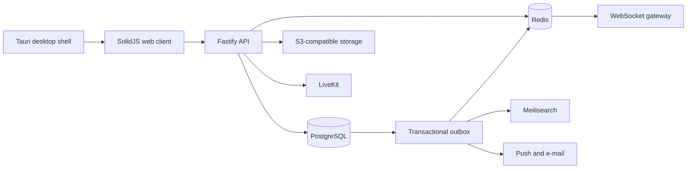

# System Overview

Strafe is a pnpm monorepo with separate browser, API, documentation, desktop,
and shared-contract packages. The boundaries are deliberate: browser code does
not reach into server modules, and shared contracts do not depend on an app.

## Request path

Fastify plugins authenticate the request, validate its TypeBox schema, and call
a domain service. Services enforce authorization and write through Drizzle.
Mutations that need downstream delivery add an outbox record in the same
transaction.

This arrangement costs more code than publishing events directly from route
handlers. The benefit is that a committed database change cannot be lost merely
because Redis or a worker was temporarily unavailable.

## Runtime responsibilities

| Component         | Responsibility                                                   |
| ----------------- | ---------------------------------------------------------------- |
| `apps/web`        | SolidJS routes, reusable UI, client state, and API integration   |
| `apps/api`        | REST, WebSocket gateway, authorization, persistence, and workers |
| `apps/desktop`    | Native Tauri packaging and operating-system integration          |
| `apps/docs`       | VitePress guides, Scalar reference, and TypeDoc output           |
| `packages/shared` | Runtime-neutral schemas, contracts, and domain types             |

## Data services

- PostgreSQL owns durable records and transaction boundaries.
- Redis carries presence, typing state, rate-limited realtime delivery, and
  resumable event streams.
- S3-compatible storage holds quarantined and ready file objects.
- Meilisearch receives permission-aware search projections through the outbox.
- ClamAV scans uploads before they become available to messages.
- LiveKit issues voice-room access outside the primary API process.

For table-level design and failure handling, continue to
[Data and realtime architecture](./data-realtime-architecture.md).
